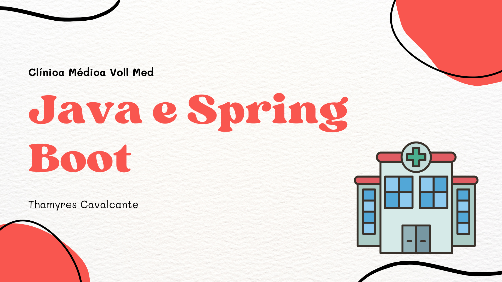
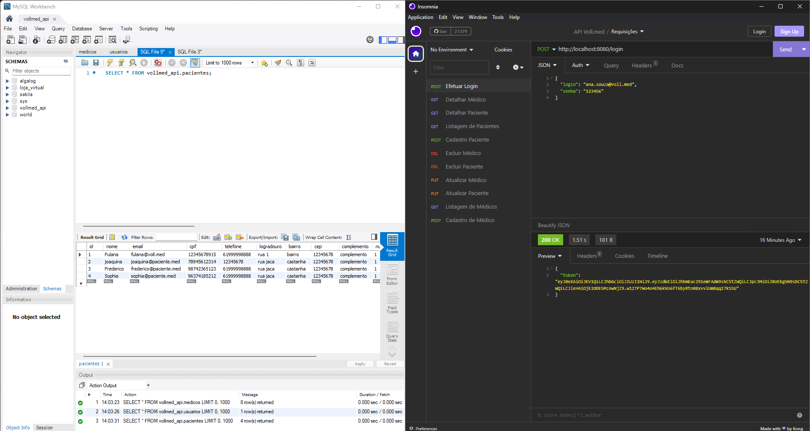
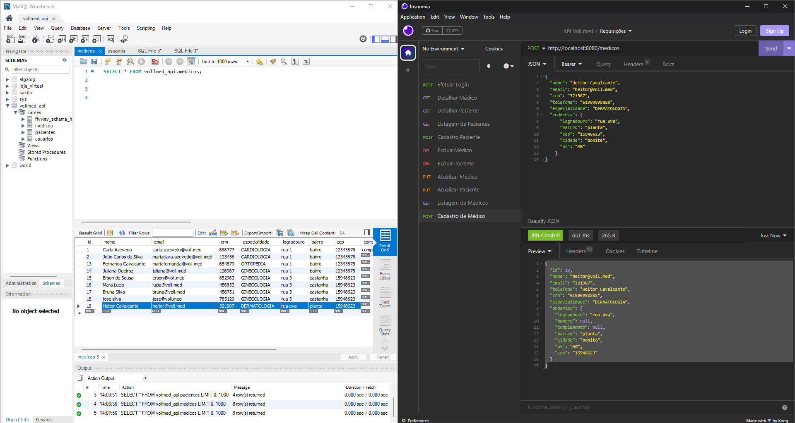
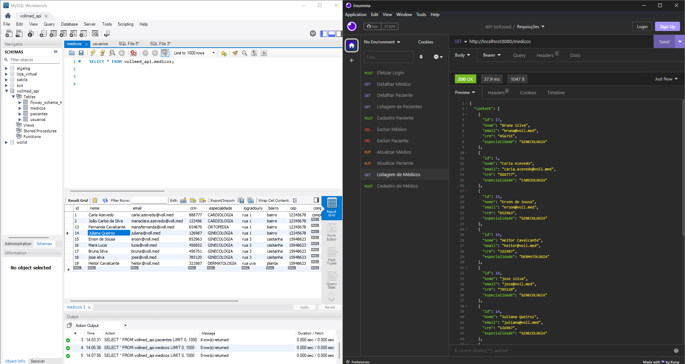
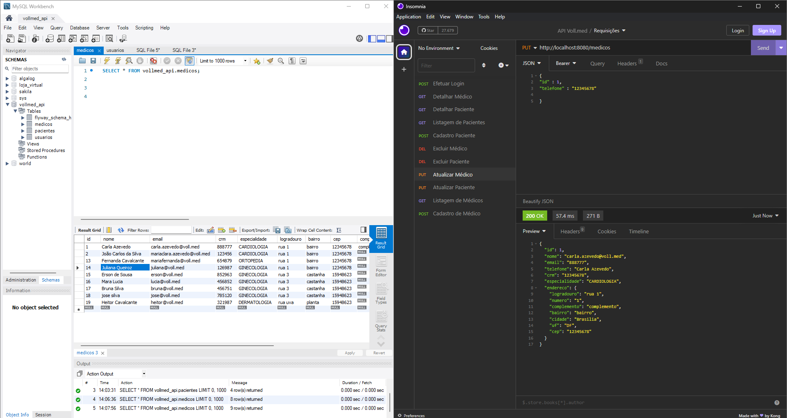

# Projeto Clínica Médica VOLL MED

| :placard: Vitrine.Dev |     |
| -------------  | --- |
| :sparkles: Nome        | **Projeto Spring Boot Rest API**
| :label: Tecnologias | Java, Spring Boot, MySQL, Maven, Flyway, Lombok
| :rocket: URL         | https://github.com/Thamyresmya/Spring_Boot_API_Voll_Med

  <a href="#-tecnologias">Tecnologias</a>&nbsp;&nbsp;&nbsp;|&nbsp;&nbsp;&nbsp;  
  <a href="#-Layout">Layout</a>&nbsp;&nbsp;&nbsp;|&nbsp;&nbsp;&nbsp; 
  <a href="#-Documentação">Documentação</a>&nbsp;&nbsp;&nbsp;|&nbsp;&nbsp;&nbsp; 
  <a href="#-projeto">Projeto</a>&nbsp;&nbsp;&nbsp;|&nbsp;&nbsp;&nbsp;  
  <a href="#-gif">Gif</a>&nbsp;&nbsp;&nbsp;&nbsp;&nbsp;&nbsp;

 

## 🚀 Tecnologias

As seguintes tecnologias foram utilizadas no desenvolvimento da API Rest do projeto:

- Java 17
- Spring Boot 3
- MySQL
- Maven
- Hibernate
- Flyway
- Lombok
- Spring Security
- Insomnia
- JUnit
- Git e Github

 

## 🎨 Layout

O layout da aplicação mobile está disponível neste link : <a href="https://www.figma.com/file/N4CgpJqsg7gjbKuDmra3EV/Voll.med">Figma</a>

 

## 📄 Documentação

A documentação das funcionalidades da aplicação pode ser acessada neste link : <a href="https://trello.com/b/O0lGCsKb/api-voll-med">Trello</a>

 

## 💻 Projeto

Nesse projeto aprendi a criar uma API Rest em Java com Spring Boot do zero, com as boas práticas REST.
- Foi desenvolvido um CRUD (Create, Read, Update e Delete) utilizando o banco de dados MySQL e o Flyway como ferramenta de Migrations da API.
- Validações utilizando o Bean Validation.
- Paginação e ordenação dos dados da API.
- Padronização dos retornos dos controllers, utilizando os códigos HTTP corretamente.
- Tratamento de erros.
- Controle de acesso com JWT.
- Foi adicionado o módulo Spring Security, implementando um mecanismo de autenticação na API.

- Isolar códigos de regras de negócio em uma aplicação.
- Implemar princípios SOLID.
- foi documentado uma API seguindo o padrão OpenAPI.
- Testes automatizados em uma aplicação com Spring Boot.
- Realizar o build da aplicação.
- Utilizar variáveis de ambiente e preparar a aplicação para o deploy.

 

## 📸 Gif
Geração de Token 
</img>

Cadastro de medico 
</img>

Listagem de todos os medico 
</img>

Atualização telefone do médico Id: 1 
</img>

## 📁 Acesso ao projeto

O código fonte está disponível neste [link](https://github.com/Thamyresmya/Spring_Boot_API_Voll_Med).

 

- Me siga nas redes sociais:
- [Linkedin](https://www.linkedin.com/in/thamyrescavalcante/)
- [Instagran](https://www.instagram.com/thamyres__cavalcante/)

 

---

Feito com ♥ by Thamyres Cavalcante.

